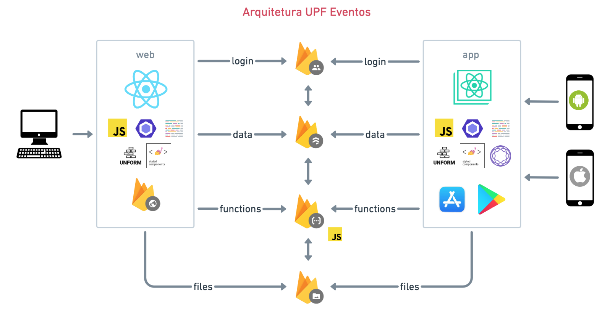

# UPF Eventos

## Instruções para execução

1. Primeiramente você vai precisar ter o [Node](https://nodejs.org/en/) e o [Yarn](https://yarnpkg.com/getting-started/install) instalados. </br>
2. Você precisa também colocar as configurações do Firebase no arquivo `.env` conforme descrito no [item](https://github.com/fabriciobedin/upf-eventos#instru%C3%A7%C3%B5es-para-configura%C3%A7%C3%A3o-do-firebase). </br>
3. Depois disso é só entrar na raiz do projeto pelo terminal e executar os seguintes comandos.

```sh
yarn install  #instala as dependências
yarn start    #inicia a aplicação
```

Depois de iniciar a aplicação, ela estará disponível nesse endereço http://localhost:3000

</br>

## Instruções para configuração do Firebase

Na raiz do projeto existe um arquivo `.env.example` que você deve fazer uma cópia e renomear pra `.env`. Nesse arquivo estão as configurações do Firebase, é só colocar as configs da nova conta do Firebase nele.</br>
Passo a passo pode ser encontrado nessa [página](https://firebase.google.com/docs/web/setup?authuser=5) </br>


### Recursos utilizados do [Firebase](https://console.firebase.google.com/u/0/)
* [Cloud Firestore](https://firebase.google.com/docs/firestore?authuser=5)
* [Cloud Functions](https://firebase.google.com/docs/functions?authuser=5)
* [Authentication](https://firebase.google.com/docs/auth?authuser=5)
* [Hosting](https://firebase.google.com/docs/hosting?authuser=5)
* [Cloud Storage](https://firebase.google.com/docs/storage?authuser=5)

### Instruções para deploy local

```sh
npm install -g firebase-tools     # dependencia necessária para utilização do Firebase CLI
firebase login                    # faça login com a conta admin do seu projeto
yarn build && firebase deploy     # gera um build da aplicação e faz o deploy completo incluindo (hosting, functions, regras do firestore e indices)
```

</br>

## Arquitetura



### Recursos utilizados da aplicação
* [React](https://pt-br.reactjs.org/)
* [React Hooks](https://pt-br.reactjs.org/docs/hooks-intro.html)
* [React Context](https://pt-br.reactjs.org/docs/context.html)
* [Styled Components](https://styled-components.com/)
* [Material UI](https://material-ui.com/)
* [Unform](https://github.com/Rocketseat/unform)
* [Date FNS](https://date-fns.org/)
* [MUI Datatables](https://github.com/gregnb/mui-datatables)
* [Yup](https://github.com/jquense/yup)
* [Polished](https://polished.js.org/)
* [ESLint](https://eslint.org/)
* [Airbnb Styleguide](https://github.com/airbnb/javascript)
* [Prettier](https://prettier.io/)
* [EditorConfig](https://editorconfig.org/)
* [Github Workflow](https://guides.github.com/introduction/flow/)


## Responsabilidades

* Arquitetura, Autenticação, Hooks -> [Fabricio Bedin](https://github.com/fabriciobedin)
* Eventos, Participantes e Inscrições -> [Alexandre dos Reis](https://github.com/alexandre-reis)
* Subeventos e Organizadores -> [Carlos Eduardo da Costa](https://github.com/caducostaa)
* Importação/Exportação de arquivos e Geração do crachá ->  [Igor Vilneck](https://github.com/vilneck)
* Documentação / Planejamento / Requisitos -> [Bruna Balbinot](https://github.com/bru95) / [Alini Lopes](https://github.com/alinilopes)

